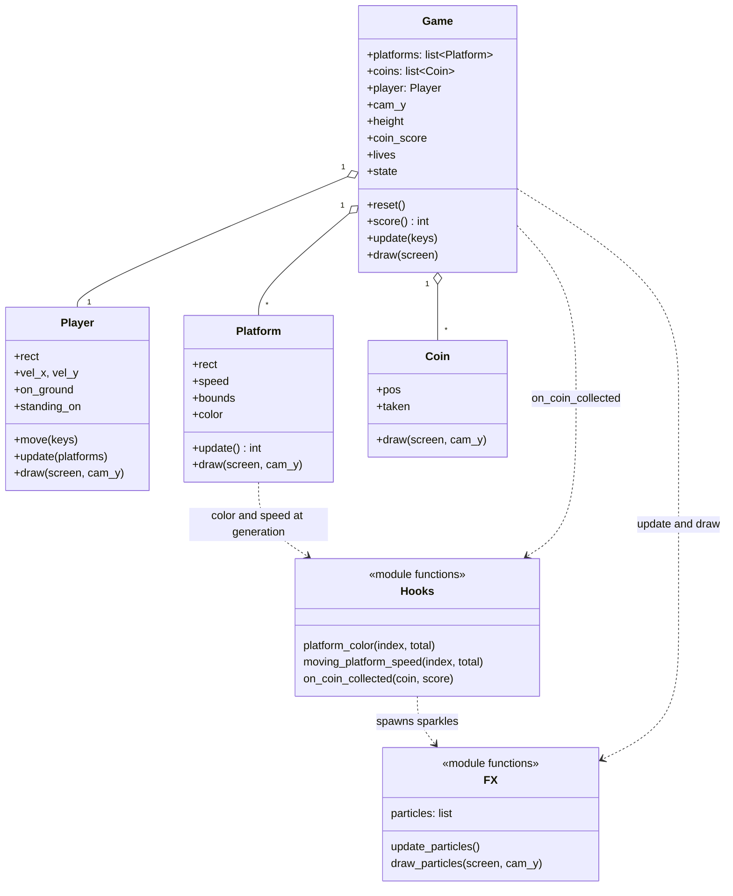

# Climber Repair Lab

This project is a single-file vertical-platformer clone using **Pygame**. It introduces students to platform collision, a scrolling camera, and item pickups using a small, readable object-oriented codebase.

---

## What's Provided
```
   ██████╗██╗     ██╗███╗   ███╗██████╗ ███████╗██████╗
  ██╔════╝██║     ██║████╗ ████║██╔══██╗██╔════╝██╔══██╗
  ██║     ██║     ██║██╔████╔██║██████╔╝█████╗  ██████╔╝
  ██║     ██║     ██║██║╚██╔╝██║██╔══██╗██╔══╝  ██╔══██╗
  ╚██████╗███████╗██║██║ ╚═╝ ██║██████╔╝███████╗██║  ██║
   ╚═════╝╚══════╝╚═╝╚═╝     ╚═╝╚═════╝ ╚══════╝╚═╝  ╚═╝
        ▲  V E R T I C A L   P L A T F O R M E R  ▲
              R E P A I R   L A B   ·   v1.1.0
```

<p align="center">
  
  
  
  
  
  
</p>

<h3 align="center">🧗 Climb. 🪙 Collect. ✨ Sparkle. 💀 Don't fall.</h3>

---

## 📑 Table of Contents

1. [Project Overview](#-project-overview)
2. [Requirements (SRS)](#-requirements-srs)
3. [System Architecture](#-system-architecture)
4. [Quick Start](#-quick-start)
5. [Tasks & Implementation Report](#-tasks--implementation-report)
6. [Requirements Traceability Matrix](#-requirements-traceability-matrix)
7. [Test Plan](#-test-plan)
8. [Design Decisions & Trade-offs](#-design-decisions--trade-offs)
9. [Known Limitations](#-known-limitations)
10. [Changelog](#-changelog)
11. [Folder Structure](#-folder-structure)
12. [Submission Checklist](#-submission-checklist)

---

## 🎯 Project Overview

**Climber** is a single-file vertical platformer built with **Pygame**. It is a compact, readable codebase for studying three classic game-programming subsystems:

| Subsystem | What it teaches |
|---|---|
| 🧱 **Collision** | One-way platform landing (only from above), moving-platform carry |
| 🎥 **Camera** | Upward-only scrolling, world-to-screen conversion |
| 🪙 **Pickups & FX** | Item collection, scoring, particle effects |

The project is a **Repair Lab**: it shipped with **1 deliberate bug** and **3 empty feature hooks**. All four have been resolved using an iterative loop of *LLM suggestion → code review → test → commit*.

> **Software Engineering focus:** minimal-diff changes, requirement traceability, verification by test, and documented design trade-offs.

---

## 📋 Requirements (SRS)

### Functional Requirements

| ID | Requirement | Status |
|---|---|---|
| **FR-01** | Player moves left/right and jumps with gravity | ✅ Provided |
| **FR-02** | Player lands on a platform **only when falling from above** | ✅ Provided |
| **FR-03** | Camera scrolls **up** with the player and **never scrolls back down** | ✅ Provided |
| **FR-04** | Falling off the bottom costs a life and respawns at the last safe platform | ✅ Provided |
| **FR-05** | Game ends at 0 lives (lose) or on reaching the top platform (win) | ✅ Provided |
| **FR-06** | Each coin awards **exactly 50 points, exactly once** | ✅ Provided, re-verified |
| **FR-07** | HUD height shows the **maximum height reached** in the current run and never decreases | ✅ **Fixed (Task 1)** |
| **FR-08** | Platform colour shifts gradually from green (low) to blue/purple (high) | ✅ **Added (Task 2)** |
| **FR-09** | Every third non-ground platform moves horizontally; the ground never moves | ✅ **Added (Task 3)** |
| **FR-10** | Collecting a coin shows a short sparkle at the coin, correct under camera scroll | ✅ **Added (Task 4)** |
| **FR-11** | `R` resets the run (platforms, coins, score, lives, effects) | ✅ Provided, extended |

### Non-Functional Requirements

| ID | Requirement | Status |
|---|---|---|
| **NFR-01** | Pygame only, no extra dependencies | ✅ |
| **NFR-02** | Single file, existing class structure preserved | ✅ |
| **NFR-03** | Runs at 60 FPS target | ✅ |
| **NFR-04** | New code must be minimal-diff and not alter unrelated behaviour | ✅ |

---


### Class and module map



### Key constants

| Constant | Value | Meaning |
|---|---|---|
| `WIDTH x HEIGHT` | 480 x 640 | Window size |
| `FPS` | 60 | Target frame rate |
| `GRAVITY / JUMP_SPEED / MOVE_SPEED` | 0.5 / -13 / 4 | Player physics |
| `LIVES_START` | 3 | Starting lives |
| `SPARKLE_COUNT / SPARKLE_LIFE` | 14 / 25 frames | Sparkle burst size and duration |

---

## 🚀 Quick Start

```bash
# 1. Requirements: Python 3.10+
python --version

# 2. Install the only dependency
pip install pygame

# 3. Play
python game.py
```

### 🎮 Controls

| Action | Keys |
|---|---|
| Move | `A` / `←`  ·  `D` / `→` |
| Jump | `Space` / `W` / `↑` |
| Reset run | `R` |

---

## 🛠 Tasks & Implementation Report

Every change was made as a **minimal diff**: only the target function or line was touched.

### 🐞 Task 1: Fix the height-score bug

| | |
|---|---|
| **Defect** | `self.height` was overwritten every frame with the player's *current* height, so it dropped whenever the player fell or backtracked |
| **Root cause** | Assignment instead of a running maximum |
| **Fix** | One line in `Game.update()` |

```diff
-        self.height = current_height
+        self.height = max(self.height, current_height)
```

`reset()` already sets `height = 0`, so each run still starts fresh.

---

### 🎨 Task 2: `platform_color(index, total)`

Smooth two-stage gradient driven by `t = index / total`:

```
 t = 0.0                      t = 0.5                      t = 1.0
 GREEN ───────────────────────► BLUE ─────────────────────► PURPLE
 (100,180,100)                 (70,130,230)                 (160,90,220)
```

- `total <= 1` gives `t = 0`, which returns plain green, so there is **no divide-by-zero**.
- `t` is clamped to `[0, 1]`, and every channel is rounded and clamped to `0..255`.
- The ground (index 0) returns the same green as the default, so default behaviour is preserved.

---

### 🚋 Task 3: `moving_platform_speed(index, total)`

```python
if index <= 0:        # ground never moves
    return 0
if index % 3 == 0:    # every third non-ground platform
    return 1.0
return 0
```

The existing `Platform.update()` handles the bounds, the direction flip and the player carry. No class was modified.

---

### ✨ Task 4: `on_coin_collected(coin, score)`

A small particle system, using Pygame only:

```
 coin touched ──► on_coin_collected ──► 14 particles @ coin world position
                                              │
        every frame:  update_particles()  ──► move, apply gravity, life -= 1, drop expired
                      draw_particles()    ──► draw at (x, y - cam_y), shrinking and fading yellow -> white
```

- Particles live in **world coordinates**, so they respect camera scrolling.
- Lifetime is **25 frames**, and expired particles are removed each frame.
- Scoring is untouched. The `+50` and `taken = True` logic still runs once per coin, before the callback.
- `reset()` clears the list. `update_particles()` runs before the `state` check, so the final burst finishes on the win/lose screen.

---

## 🔗 Requirements Traceability Matrix

| Requirement | Implemented in | Verified by |
|---|---|---|
| FR-06 (+50 once) | `Game.update` coin loop (unchanged) | TC-07, TC-08 |
| FR-07 (peak height) | `Game.update`: `max(self.height, current_height)` | TC-01, TC-02 |
| FR-08 (colour gradient) | `platform_color()` | TC-03, TC-04 |
| FR-09 (moving platforms) | `moving_platform_speed()` + existing `Platform.update` | TC-05, TC-06 |
| FR-10 (sparkle) | `on_coin_collected()`, `update_particles()`, `draw_particles()` | TC-07, TC-09, TC-10 |
| FR-11 (reset) | `Game.reset()` (+ `particles.clear()`) | TC-02, TC-11 |

---

## 🧪 Test Plan

### Manual tests

| ID | Scenario | Steps | Expected |
|---|---|---|---|
| **TC-01** | Height never decreases | Climb a few platforms, then drop down | HUD height holds at its peak |
| **TC-02** | Height resets | Press `R` after a run | Height starts again from the spawn value (6m) |
| **TC-03** | Gradient visible | Climb the full column | Platforms shift green, then blue, then purple |
| **TC-04** | Ground colour | Look at the bottom platform | Same green as the default |
| **TC-05** | Moving platforms | Watch platforms 3, 6, 9... | They slide left/right, others stay static |
| **TC-06** | Carry | Stand on a moving platform | Player moves along with it, no sliding off |
| **TC-07** | Coin scoring | Touch one coin | `Coins` +1, score +50, once only |
| **TC-08** | No double count | Stay on a coin's spot | Score does not increase again |
| **TC-09** | Sparkle + camera | Collect a coin while scrolling | Sparkles stay on the coin spot, not the screen |
| **TC-10** | Sparkle lifetime | Watch a burst | Fades out in under 0.5 s |
| **TC-11** | Reset clears FX | Collect a coin, press `R` instantly | No leftover sparkles |

### Automated sanity checks (headless)

```bash
SDL_VIDEODRIVER=dummy SDL_AUDIODRIVER=dummy python - <<'EOF'
import pygame, game
pygame.init(); screen = pygame.display.set_mode((game.WIDTH, game.HEIGHT))
g = game.Game()
class K(dict):
    def __getitem__(self, k): return False
g.coins = [game.Coin(g.player.rect.centerx, g.player.rect.centery)]
g.update(K())
assert g.coin_score == 50 and len(game.particles) == game.SPARKLE_COUNT
for _ in range(40): g.update(K()); g.draw(screen)
assert g.coin_score == 50 and len(game.particles) == 0
g.reset(); assert len(game.particles) == 0
print("ALL CHECKS PASSED")
EOF
```

---

## 🧠 Design Decisions & Trade-offs

| Decision | Why | Trade-off |
|---|---|---|
| Module-level `particles` list | `on_coin_collected(coin, score)` has no access to `Game`, and the signature had to stay | Global state, so it must be cleared in `reset()` |
| Particles stored in **world** coordinates | The camera conversion (`y - cam_y`) matches platforms and coins | None |
| `update_particles()` runs **before** the state check | Sparkles finish animating on win/lose screens | Particles update even when the game is over |
| Platform speed fixed at `1.0` | See [Known Limitations](#-known-limitations) | Less speed variety |
| Hook functions kept as the only edit points | Preserves the lab's structure and keeps diffs tiny | Some logic sits outside classes |

---

## ⚠️ Known Limitations

- **Spawn height shows 6m.** The height formula uses the ground at `HEIGHT - 40`, while the player spawns at `HEIGHT - 100`, so the run starts at 6m. This was left alone because the task only covered the "never decreases" bug.
- **Fractional platform speeds drift.** `pygame.Rect` stores integer coordinates, so a speed like `1.25` or `1.5` is truncated differently when moving right and left. Platforms use `1.0` to keep the oscillation symmetric. Smoother variable speeds would need a float x position inside `Platform`.
- **Level is randomised.** Platforms and coins are regenerated on every `reset()`, so no two runs are identical.

---

## 📜 Changelog

### v1.1.0: Repair Lab complete
- **Fixed:** height score now tracks the run's maximum (Task 1)
- **Added:** green to blue to purple platform gradient (Task 2)
- **Added:** every-third-platform horizontal movement (Task 3)
- **Added:** particle sparkle on coin pickup with camera-aware drawing (Task 4)
- **Changed:** `Game.reset()` clears active particles

### v1.0.0: Initial lab build
- Playable Climber with 1 bug and 3 empty hooks

---

## 📁 Folder Structure

```
climber/
├── game.py       # entire game: constants, hooks, FX, classes, main loop
└── README.md     # you are here
```

---


---

<p align="center">
  <b>Built with Python 🐍 · Pygame 🎮 · and a lot of iterative AI pair programming 🤖</b><br>
  <sub>Author: &lt;your name&gt; · Course: &lt;course / section&gt;</sub>
</p>
A working Climber game with:

- A player-controlled climber with gravity, jumping, and collision that only lands from above (never snaps up through a platform from below)
- A generated column of platforms leading to the top of the level, with a camera that scrolls up as the player climbs (and never scrolls back down)
- Coins scattered on some platforms that add to the score when collected
- Lives, scoring, and win/lose conditions (falling off the bottom of the screen costs a life; reaching the top wins)

It has **one deliberate bug** and **three optional features** left as empty functions. You are expected to **analyze**, **interact with an AI assistant**, and **complete/fix** the game to make it fully functional and more interesting.

### **Use an LLM (e.g. ChatGPT or Claude) as your debugging and pair-programming partner for this lab.**

---

## Getting Started

### Setup

1. Make sure you have Python 3.10+ installed.
2. Install dependencies:

```bash
pip install pygame
```

3. Run the game:

```bash
python game.py
```

**Controls:** A/Left or D/Right to move, Space/W/Up to jump, `R` to reset.

---

## Tasks to Complete

Each task must be completed using an iterative process involving LLM suggestions and your critical code review.

### Task 1: Fix the height-score bug

> The "Height" shown in the HUD is meant to track the *best* height the player has ever reached during a run — like every real climbing or endless-runner score, it should never go down. In the current build, the height recalculates fresh every frame from the player's current position, so climbing up and then coming back down (for example, after riding a moving platform, or backtracking to grab a coin) makes the displayed height drop instead of holding at its peak. Look at where `self.height` is assigned in `Game.update` and compare it with how the height is actually meant to behave.

### Task 2: Implement `platform_color(index, total)`

> Called once per platform, at generation time, as `self.color = platform_color(index, total) or (100, 180, 100)` inside `Platform.__init__`. `index` is the platform's position in the climb (0 is the ground, higher numbers are higher up); `total` is the total number of generated platforms. Return an `(r, g, b)` color, or `None` to keep the default green. Idea: shift the color gradually as `index` approaches `total`, so higher platforms look different from lower ones.

### Task 3: Implement `moving_platform_speed(index, total)`

> Called once per (non-ground) platform, at generation time, as part of `self.speed = moving_platform_speed(index, total) or 0`. It receives the same `index`/`total` as above and should return a horizontal oscillation speed in pixels per frame, or `None`/`0` to keep that platform static. The oscillation mechanism itself — bouncing between bounds, carrying the player along while they stand on it — is already implemented in the `Platform` class and `Game.update`; you only need to decide which platforms move and how fast. Idea: return a small speed for every third platform.

### Task 4: Implement `on_coin_collected(coin, score)`

> Called from `Game.update` the instant the player touches a coin, right after its 50 points have been added to the score and the coin has been marked collected. It receives the `Coin` that was collected and the score after it was added. Its return value is ignored. Idea: a sparkle effect at the coin's position, or a running "combo" counter for coins collected without falling.

---

## Expected Behavior

- The player only lands on a platform when falling onto it from above; it can't be snapped up onto a platform's underside or side
- The camera scrolls upward as the player climbs and never scrolls back down, even if the player falls
- Coins disappear the moment they're touched and immediately add to the score
- Falling off the bottom of the screen costs a life and respawns the player at their last safe platform; the game ends when lives reach zero
- Reaching the topmost platform ends the game with a win


